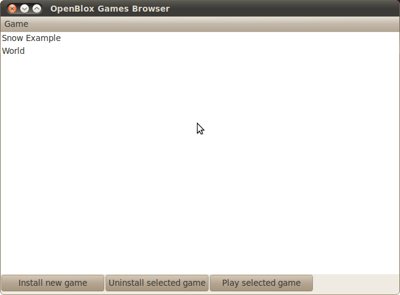

==================
End-user tutorials
==================

.. note::

    If you're looking for tutorials on how to install OpenBlox,
    go to :doc:`/gettingstarted`, instead.

.. _playing-a-game:

Playing a game
==============

Open up the OpenBlox game launcher. It's in different locations, depending upon
which OS you've installed OpenBlox on:

* On Windows, it's under :guilabel:`Start` > :guilabel:`All Programs` >
  :guilabel:`OpenBlox` > :guilabel:`OpenBlox`
* On Linux (with GNOME, KDE will differ slightly), the OpenBlox game launcher is in
  :guilabel:`Applications` > :guilabel:`OpenBlox` > :guilabel:`OpenBlox`
* On Mac OSX, it's the file ``tools/oblaunchgui.py`` located in the directory
  you extracted OpenBlox to
      
If you've just downloaded a non-final (i.e, alpha or beta) release of OpenBlox,
you'll find the launcher in one of 2 locations:

* On Windows, it's the batch script ``startlauncher.bat``. Double-click it
  to start OpenBlox
* On other systems (Linux, Mac OSX), it's the shell script ``startlauncher.sh``.
  Double-click it to start OpenBlox

You'll see a window come up that looks something like this:

To play an installed game, just click on its name, and then
press :guilabel:`Play selected game`.

**How to play**

 * Move with the arrow keys
 * Jump with the spacebar
 
Some games also use up to 4 keys on your keyboard - their OpenBlox names [1]_,
along with their default binding, are:

* :guilabel:`A` - by default, :guilabel:`A`
* :guilabel:`B` - by default, :guilabel:`S`
* :guilabel:`X` - by default, :guilabel:`X`
* :guilabel:`Y` - by default, :guilabel:`C`

Installing a game
=================

First, you have to open up the OpenBlox game launcher (see :ref:`playing-a-game` for
more info on this). Once you've done that, press on :guilabel:`Install new game`.
A file browser window will come up; navigate to the OpenBlox game you want to
install.

Once you've selected it (and possibly pressed :guilabel:`Open`), the game
will appear in OpenBlox's list of installed games. See :ref:`playing-a-game` for
instructions on how to play your newly-installed game.

Uninstalling a game
===================

Once you've opened up the OpenBox game launcher, removing a game is easy: Just
click on its name, and press :guilabel:`Uninstall selected game`.

.. warning::

    The game itself is removed from your hard drive when you uninstall it,
    so make sure you have a copy of the game handy, in case you
    want to reinstall it!
    
.. rubric:: Footnotes

.. [1] These names are different from the actual corresponding key names on
       the keyboard, they're just named so the people can choose a keyboard layout
       that works for them, and games will still work, even with changed
       key mappings.
       
Configuring OpenBlox
====================

.. versionadded:: 0.7

OpenBlox 0.7 comes with a new graphical configuration tool, which
you can start by doing one of the following:

 * On Windows, double-click the file ``tools\startobconfig.bat``
 * On other systems (Linux, Mac OSX), double-click the file ``tools/startobconfig.sh``