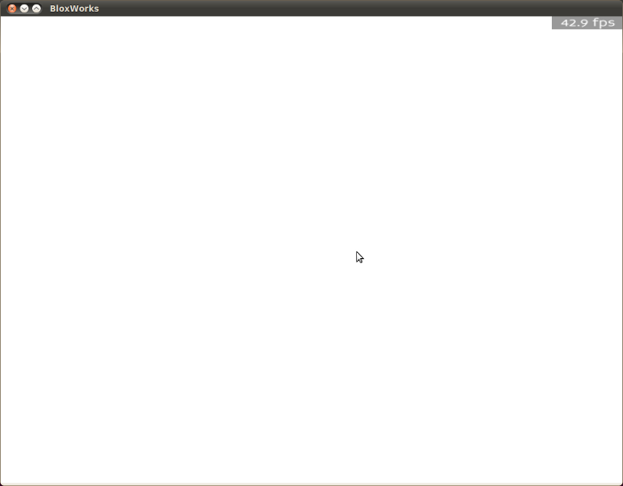

=========
BloxWorks
=========

.. versionadded:: 0.7

BloxWorks is OpenBlox's scene editor [1]_, and thus as of OpenBlox 0.7 the
primary tool for making OpenBlox games.

Introduction
============

Before OpenBlox 0.7, the primary (and only) method of creating games with OpenBlox
was by directly editing each game's XML + Lua sources. BloxWorks, on the other hand,
lets users modify games by visually dragging/editing bricks and other elements around.

This is much easier for non-technical users to get up to speed with, plus, BloxWorks'
approach provides faster turn-around due to its WYSIWYG-like building methodology.

Getting started
===============

To start BloxWorks, you should do one of three things:

 * On Windows, go to :guilabel:`Start` > :guilabel:`All Programs` > :guilabel:`OpenBlox` > :guilabel:`BloxWorks`
 * On Linux (with GNOME), go to :guilabel:`Applications` > :guilabel:`OpenBlox` > :guilabel:`BloxWorks`
 * On Mac OSX, execute the file ``tools/bloxworks/main.py`` located inside
   the directory you extracted OpenBlox in
   
Once you've started BloxWorks, you'll be greeted with a window not unlike the following:

The first thing you'll notice is that *nothing* is displayed on-screen. This isn't
a mistake; it's just BloxWorks' keep-the-interface-out-of-the-way philosophy at
work. Now, let's make a new game: Move your mouse to the center+top of the window,
and a toolbar will appear (we'll use it again later on). Click the little page
with a "+" symbol; that button creates a new game.

In the dialog that appears, enter the name for your game (be careful not to
press :guilabel:`Enter`!), and then enter your OpenBlox username for the author field.

Now, go back to the Name field and press :guilabel:`Enter`. The dialog will disappear,
and you'll be greeted with an empty game, containing only a skybox. Congratulations!

.. rubric:: Footnotes

.. [1] A *scene editor* is a program (or possibly a group of programs) that provides
       a higher-level (usually WYSIWYG) approach to making a game or 3D scene.