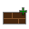

=========
BloxWorks
=========

.. warning::

	This document is a work in progress!

.. versionadded:: 0.7

BloxWorks is OpenBlox's scene editor [1]_, and thus as of OpenBlox 0.7 the
primary tool for making OpenBlox games.

Introduction
============

Before OpenBlox 0.7, the primary (and only) method of creating games with OpenBlox
was by directly editing each game's XML + Lua sources. BloxWorks, on the other hand,
lets users modify games by visually dragging/editing bricks and other elements around.

This is much easier for non-technical users to get up to speed with, plus, BloxWorks'
approach provides faster turn-around due to its WYSIWYG-like building methodology.

Getting started
===============

To start BloxWorks, you should start the executable `bloxworks` inside the `tools`
directory where you extracted OpenBlox. Once you've started BloxWorks, you'll be greeted with a window not unlike the following:

The first thing you'll notice is that *nothing* is displayed on-screen. This isn't
a mistake; it's just BloxWorks' keep-the-interface-out-of-the-way philosophy at
work. Now, let's make a new game: Move your mouse to the center+top of the window,
and a toolbar will appear (we'll use it again later on). Click the little page
with a "+" symbol; that button creates a new game.

In the dialog that appears, enter the name for your game (be careful not to
press :guilabel:`Enter`!), and then enter your OpenBlox username for the author field.

Now, go back to the Name field and press :guilabel:`Enter`. The dialog will disappear,
and you'll be greeted with an empty game, containing only a skybox. You just created your first blank OpenBlox game!
Now let's add a brick. Move your mouse to the left corner of the screen, and you'll see
another panel. Click the button that looks like:

Now we have a gray 2x4x1 brick in the world, but it has a boring color. Let's change it
to a nice orange. First, you'll need to click on the brick you just added.
You'll see a panel appear on the right side of your screen (called the "property editor").
Click the "Color" textbox, and enter the following RGBA color code::

	255, 127, 36
	
Press Enter, and you'll see your brick change to a bright orange.
Now let's resize our 2x4x1 brick to a 8x8x1 brick. There are two ways of doing this:

* Using the property editor
* Using the resize tool

Since the resize tool is a bit more intuitive for first-time users, we'll cover that
here (though you can see the property editor method under `Adding a brick`).
Move your mouse to the bottom of the screen, and you'll see a toolbar appear. Click
the button that looks like:

Now click on your orange brick, and then drag with the mouse button until the brick becomes a 8x8x1
brick. You can check the size of the brick using the property editor.
Now we've resized your brick, let's save your progress (better safe than sorry, after all).
Move your mouse to the top of the screen, and another toolbar will appear. Click the button that looks like:

Your new game was just automatically saved!

.. note::

	BloxWorks will currently not warn you if you're about to exit without saving. Be sure to save before
	exiting BloxWorks.
	
Let's anchor your brick so it doesn't fall. Click on the brick to bring up the property editor. Next,
check the :guilabel:`Anchored` checkbox. At this stage, it would be a good idea to save again, so go ahead and do that now.

Now let's pack your game so you can share it with others, and play it yourself. Again, move your mouse to the top
of the screen, and click the button that looks like:

Now open up the OpenBlox games launcher and click :guilabel:`Install new game`. Navigate to the
directory `tools/bloxworks/projects/(your game name here)`. There will be file called `(your game name here).zip`.
Select that file as the game to install. Once you done this, your game will be playable from the OpenBlox games launcher.

Cheat sheet
===========

Adding a brick
--------------

Once you've opened BloxWorks and created a new project (or opened an pre-existing one),
adding a brick is simple: Move your mouse to the left corner of the screen to reveal a panel.
Click the first icon, the one that looks like:

Once you've done that, you'll see a gray 2x4x1 brick appear in the center of your world.

Removing a brick
----------------

This is a relatively simple task:

 * Click on the brick you want to remove
 * Click the :guilabel:`Remove brick` button
 
.. warning::

	Deletion of bricks can currently not be undone!
	
Controlling the camera
----------------------

To rotate the camera, hold down the right mouse button and move the mouse.
To move the camera, hold down the right mouse button and use the arrow keys
to move the camera in the X-Y plane.

Moving a brick
--------------

Move your mouse to the bottom-center of the screen. You'll see a panel be revealed.
Click the button with the icon that looks like:

Now, click on the brick you want to move. Here's how to actually move it around:

 * Moving the mouse across the screen moves the brick in the X-Y axes
 * Moving the scroll wheel moves the brick in the Z axis (i.e, up and down)
 
To stop moving the brick, click the left mouse button again. To disable the Move tool,
just click on its icon again.

Resizing a brick
----------------

Reveal the lower panel, as you did in the "Moving a brick" section. Now, click the
button that looks like:

Just like with the Move tool, click on the brick you want to resize.
Here's an explanation of what to do next:

 * Moving the mouse across the screen re-sizes the brick in the X-Y axes
 * Moving the scroll wheel re-sizes the brick in the Z axis
 
To stop resizing the brick, click the left mouse button again. To disable the
Resize tool, click on its icon.

You can also re-size a brick using the property editor. Click on a brick, select the
"Size" textbox, and enter the new size for the brick.

Repainting a brick
------------------

To repaint a brick, click on the brick you want to repaint. In the Color textbox,
type in the RGBA (Red Green Blue Alpha) color you want to brick to have, with the
various values separated by commas. When you want to brick to take on
that color, press Enter.

Since OpenBlox lets you use raw RGBA colors instead of simple named colors,
you can use/create a lot of different color combinations - 4,228,250,625, to be exact.

.. note::

	For a really comprehensive table of RGB colors, see:
	http://web.njit.edu/~kevin/rgb.txt.html.
	
	Also note that that site doesn't list A values - the A (4th number)
	value controls transparency (255 being completely opaque, 0 being invisible),
	so that is left up to you to decide.

.. rubric:: Footnotes

.. [1] A *scene editor* is a program (or possibly a group of programs) that provides
       a higher-level (usually WYSIWYG) approach to making a game or 3D scene.